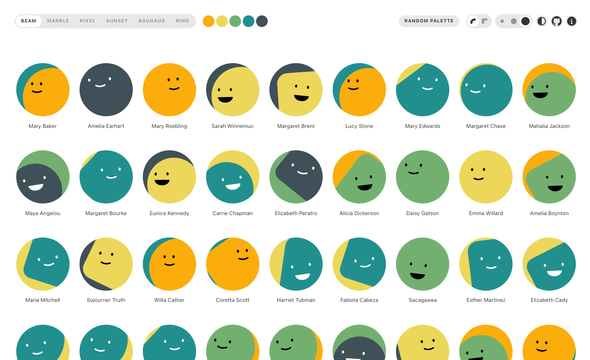

# Boring Avatars (original)

## More fun than a generic user icon

- Procedurally-generated
- SVG (use at any size)
- React-only

[https://boringavatars.com/](https://boringavatars.com/)

## Styles

## Similar Libraries

- Avataars: https://www.npmjs.com/package/avataaars
- Gravatar: https://en.gravatar.com/
- Dicebear: https://dicebear.com/

Dicebear is really cool.

I did not know about it until recently.

