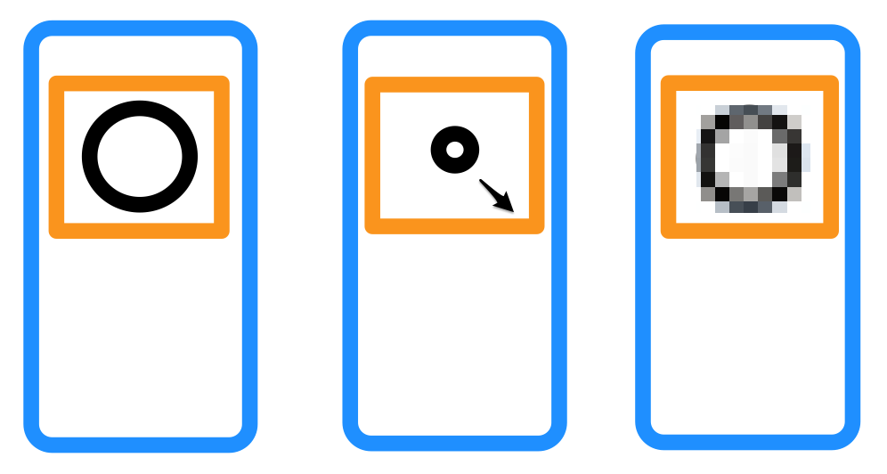

# React Native

## One Big Issue


## Why?

[react-native-svg](https://github.com/software-mansion/react-native-svg) (also used by Expo's wrapper)

```typescript
const SIZE = 36;
/// ...
    <Svg
      viewBox={'0 0 ' + SIZE + ' ' + SIZE}
      fill="none"
      xmlns="http://www.w3.org/2000/svg"
      width={props.size}
      height={props.size}
    >
```

```typescript
<Rect
  x={20 + data.eyeSpread}
```

<div class="notes">
Normally this works fine.

Mobile platforms, (iOS at least), do not support native SVG.

</div>

## Why? (Visual)



## The Fix

```typescript
const { name, colors, size } = props;
  // ...
    <Svg
      viewBox={'0 0 ' + size + ' ' + size}
      fill="none"
      width={size}
      height={size}
    >
```

```typescript
const scaleNumber = createScaleNumber(36, size);
const EYE_RIGHT_X = scaleNumber(20);
// ...
    <Rect
      x={EYE_RIGHT_X + eyeSpread}
```

## My Fork

[https://github.com/cmgriffing/react-native-boring-avatars](https://github.com/cmgriffing/react-native-boring-avatars)
