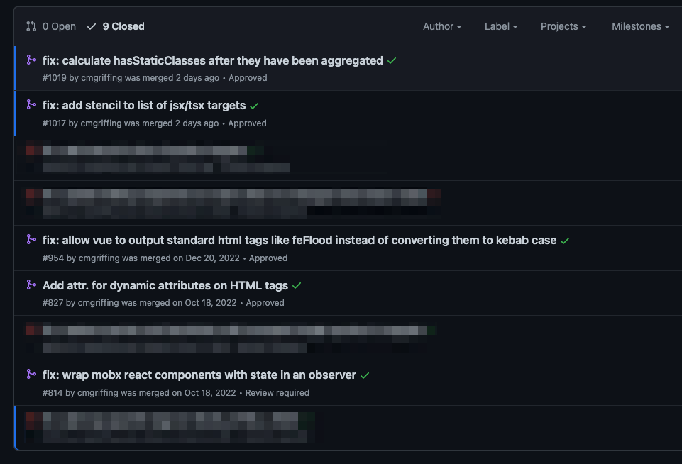

# Even More Boring

## Component Example


## Quirks

- utils must be in separate file
- generators use string building under the hood
- barebones output

## Boilerplates

- Vite config or other
- folder structure
- package.json templating and dependencies, etc.

## "mitosis compile"

- Per file
- No knowledge of greater project (imports, etc.)

```typescript

enum Target {
  Angular = "angular",
// ...
Object.values(Target).forEach((target) => {
  // ...
  mitosisFiles.forEach((filePrefix) => {
    // ...
    const execCommand = `pnpm mitosis compile -t=${target} --out=${outPath} ${inputFile} --force`;
```

## Plugins

```typescript
{
  // ...
  pre: (code: string) => {
    let newCode = code;

    newCode = newCode.replace(
      new RegExp(`(import \\S+ from ".\\/avatars\\/avatar-\\S+)";`, "gm"),
      `$1.component";`
    );
```

## I'm Not Alone

[https://www.youtube.com/watch?v=07UW3REM6k8](https://www.youtube.com/watch?v=07UW3REM6k8)


## Mitosis bugs and fixes

It's a big surface area.

Common issues I ran into:

- SVG (feFlood, stroke-width vs strokeWidth)



## Why did the scuba diver fail biology?

## He was below “C” level.


