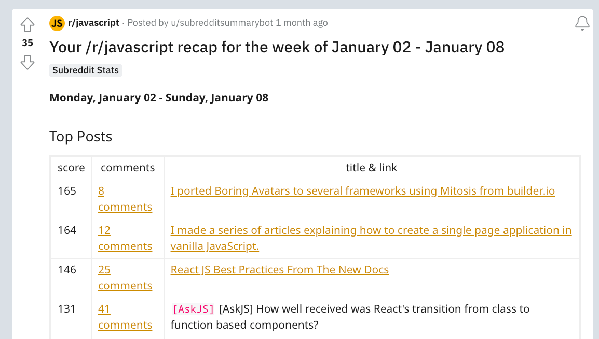

# Even More Boringer

## "mitosis build"

Fixed several Naming and File pathing issues

- Still need boilerplates

## Demo sites

- Simplest starters for a static site because of GH-pages
- Clone of boringavatars.com

## Components for the Demo site

Sounds like a job for Mitosis!

## Result

[https://cmgriffing.github.io/boringer-avatars/](https://cmgriffing.github.io/boringer-avatars/)

## NPM

## Figma

## ProductHunt

## Reddit Post

## Reddit Recap

## Why are there so few Biology jokes about the eye?

## Because they keep getting cornea and cornea.

